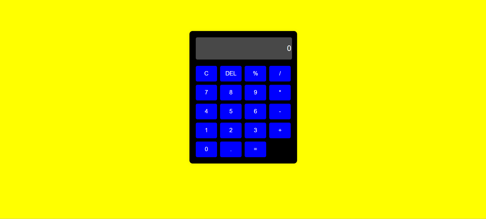

# Calculator App

A simple and responsive calculator built with React. This project demonstrates the core concepts of React, including state management and event handling. The calculator supports basic arithmetic operations such as addition, subtraction, multiplication, and division. It's fully responsive, ensuring a seamless experience across all device sizes.

## Features
- Clear and delete functionality
- Responsive design for mobile, tablet, and desktop
- User-friendly interface with interactive button press effects
- Error handling for invalid operations

## Technologies Used
- HTML
- CSS
- Javascript
- React

## Screenshots

## Installation
1. Clone the repository: `git clone https://github.com/jatintyagi1/calculator.git`
2. Navigate into the directory: `cd calculator`
3. Install dependencies: `npm install`

## Usage
- Enter numbers using the keypad.
- Click operation buttons to perform calculations.

## How to Contribute
- Fork the repository.
- Create a new branch (`git checkout -b feature/add-new-feature`).
- Make changes, commit, and push to the branch.
- Submit a pull request.

## License
This project is licensed under the MIT License.

## Contact
For questions or feedback, contact me at tyagijatin6263@gmail.com.

## Additional Notes
- This project was created as part of a React development course.
